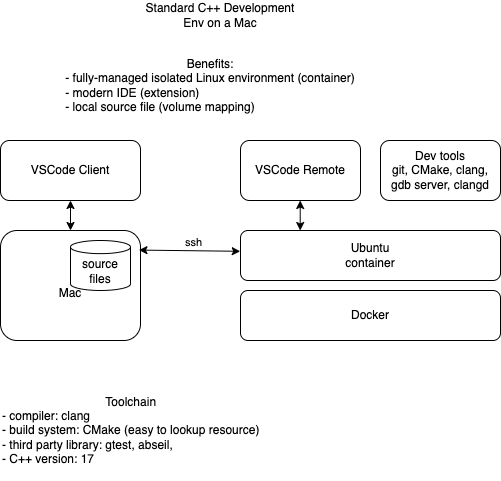

# Standard Linux Ubuntu Container for Development

This repo provides an standard environment for development in linux container.
The docker image, kuangyu0801/std-dev-ubuntu



This goal is to solve issues from development on non-linux OS.
- Complex package/library management according to application's requirement.
- Excess HW resources requirement for starting a simple VM.
- Overhead for VM configuration and management.
- Missing direct source file access.
- Missing responsive modem IDE support.

Build image locally
```
docker build -t kuangyu0801/test-ubuntu .
```
Start container locally:
```
docker run -it kuangyu0801/test-ubuntu
```

Reference:
- http://redhatgov.io/workshops/security_containers/exercise1.2/
- https://wiki.ubuntu.com/Releases 
- Alternative to passwd --stdin in Ubuntu: https://askubuntu.com/questions/1115795/alternative-to-passwd-stdin-in-ubuntu
  - echo "username:cleartext_password" | sudo chpasswd
- https://www.digitalocean.com/community/tutorials/how-to-create-a-new-sudo-enabled-user-on-ubuntu-22-04-quickstart